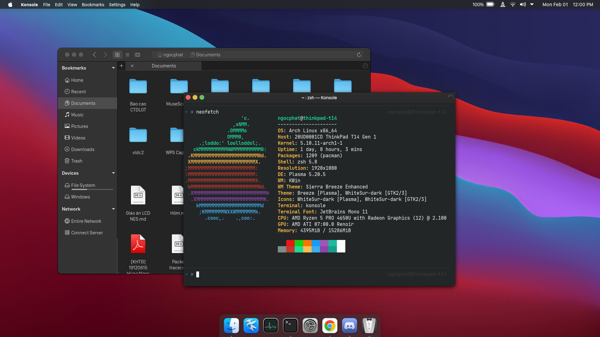

# (Yet another) KDEintosh Theme



I had been using Hackintosh on my old ThinkPad T430s for almost a year (you can have a look at my OpenCore T430s repository if interested), until I migrated to my new ThinkPad T14, which is an AMD machine, hence macOS will not ever be able to run on it. After months of trial-and-error, I finally managed to find the best combination of Plasma themes to create an approximately 70% similar look to the original macOS Big Sur UI (imo).

Last updated: February 2020, Plasma 5.20.5.

## Disclaimer
- I don't personally own the themes included here. They are all originally made and owned repspectively by their authors.
- The package management commands I include here are specified to Arch Linux only (and its derivatives). You have to figure out what is it on your distro by yourself.

## Components
- **Plasma style**: WhiteSur-dark (edited, available in this repository).
- **Application style**: kvantum-dark.
- **GTK style**: WhiteSur-dark [original](https://store.kde.org/p/1403328/).
- **Window decoration**: SierraBreezeEnhanced.
- **Colors**: WhiteSurDark [original](https://github.com/vinceliuice/WhiteSur-kde)
- **Kvantum theme**: Mojave-dark [original](https://store.kde.org/p/1252328/).
- **Icons**: WhiteSur-dark [original](https://www.pling.com/p/1405756/).
- **Cursor:**: WhiteSur Cursors [original](https://www.pling.com/p/1355701/).
- **Konsole color scheme**: Breeze (original).
- **Latte dock layout**: mcOS BS Layout for Latte Dock (edited, available in this repository). Original [here](https://store.kde.org/p/1399346/).

## Latte plugins
- Application Title.
- Latte Spacer.
- Latte Seperator.
- Better inline clock.
- Big Sur Inline Battery.

## Instructions
1. Install the original WhiteSur theme as described in the [original repository](https://github.com/vinceliuice/WhiteSur-kde). You have to install WhiteSur-dark-gtk manually in the given link above.
2. Go to `~/.local/share/aurorae/themes/` and delete the `WhiteSur-dark` folder. Extract the given zip in this repo to the same location. I edited this theme so that some transparent components' background (notifications, pop-up windows, ...) looks more comfortably.
3. Download and apply SierraBreezeEnhanced (window decoration). Please refer to the `WindowDeco.png` file for SierraBreezeEnhanced's configuration. This one looks and suits better in terms of color than the one provided in WhiteSur (but it feels more like Catalina).<br>
Installation in Arch Linux can be done via yay:
    ```bash
    $ yay -S sierrabreeze-kwin-decoration-git
    ```
4. Remove all the panels on your current desktop (Latte will take care of it later). 
5. Install all the required Latte plugins, then import and apply the provided Latte layout.
6. Done (maybe).

## Further customizations
### macOS neofetch
- Install neofetch (of course) and add the following line to your shell rc file (such as `.zshrc` or `.bashrc`):
    ```bash
    alias neofetch="neofetch --ascii_distro=macos | sed \"s/Arch Linux/macOS Big Sur 11.1/g \""
    ```
- Then reload your shell's configuration
    ```bash
    $ source ~/.zshrc
    # Or
    $ source ~/.bashrc
    ```
- The above `alias` command will replace your distro ascii art with the Apple logo, and replace your distro name to `macOS Big Sur 11.1` (remember to place your distro name in place of `Arch Linux` in my command). You can further customize the arguments to replace more.
- You can also change your laptop name to something like `MacBookPro`:
    ```bash
    $ sudo echo MacBookPro > /etc/hostname
    $ reboot    
    ```

### Global menu compability for GTK applications
- Install the `appmenu-gtk-module` package and `libdbusmenu-*`. You can install them on Arch Linux by issueing the following command:
    ```bash
    $ sudo pacman -Sy appmenu-gtk-module $(pacman -Ssq libdbusmenu)
    ```

### GNOME applications
- I have to admit that KDE is more customizable, with fancy blur effects that can be altered to a kinda nearly authentic macOS experience. But their bundled applications cannot do so as good as their GNOME alternatives.
- I will cover 3 applications that I use the most (file manager, document viewer, image viewer). You can apply the similar procedure for the others.
- Uninstall dolphin and its dependencies (`dolphin-plugins` and `konqueror`):
    ```bash
    $ sudo pacman -Rncs dolphin
    ```
- Install ElementaryOS' file manager because it looks like macOS Finder more than anything else.
    ```bash
    $ sudo pacman -Sy pantheon-files file-roller
    ```
- Install Eyes of GNOME (image viewer) and Evince (document viewer)
    ```
    $ sudo pacman -Sy eog evince
    ```
- Change default applications in System Settings to match those.
